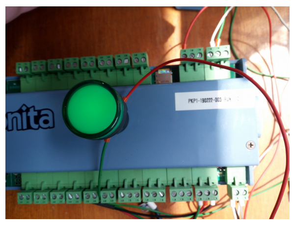

# Alarm

| Type A | Type B | Type C |
| ------ | ------ | ------ |
| Yes    | Yes    | Yes    |

 

Sebelum tes alarm relay, wajib dilakukan pengetesan relay terlebih dahulu. Berikut
akan dijelaskan bagaimana cara tes relaynya.

1. Pasang input power relay 12-24 volt. Input power relay bisa diambil dari
   tegangan power rinjani, caranya dengan menghubungkan kaki positif power
   dengan kaki positif relay seperti gambar berikut.

   

2. Sambungkan led ke `port R1-R4 relay` di modul rinjani. Wiring pemasangannya
   seperti berikut

   

3. Setelah terpasang dan terkoneksi pada modul Rinjani buka terminal dengan
   perintah command `sudo gtkterm` kemudian akan muncul _software Serial Port
   Terminal (gtkterm)._

4. Lakukan setting configuration gtkterm, `Configuration > Port`, lalu setting
   konfigurasinya seperti gambar berikut. Klik OK

   

5. Jalankan ENTER berulang kali untuk memastikan modul Rinjani berfungsi,
   dengan indikasi muncul command (rinjani) lalu masukkan passwordnya, `monita`,
   kemudian jalankan perintah

6. Ketik `cek_relay` untuk melihat status relay

7. Ketik `set_relay 1 1` maka relay1 akan aktif

`set_relay 1 0` maka relay1 akan nonaktif

8. `Cek relay` untuk melihat kembali status relay setelah diaktifkan

9. Lakukan hal yang sama pada relay 2 – relay 4 untuk mengecek relaynya.

10. Status relay harus dalam keadan _off_ (mati) sebelum menjalankan alarm relay

11. Ketik `cek_alarm` untuk melihat status alarm

12. Ketik `set_alarm 1 data 11` untuk set alarm nomor ke-1 dan data ke-11 sebagai
    data yang akan mentrigger alarm jika melewati batas

13. Ketik `set_alarm 1 batasL 1.6` untuk set alarm nomor ke-1 dan batas bawah
    nilainya 1.6

14. Ketik `set_alarm 1 relayL 1` untuk set alarm nomor ke-1 dan set relay ke-1 yang
    akan aktif jika nilai data melebihi batas bawah

15. Ketik `set_alarm 1 batasH 3.2` untuk set alarm nomor ke-1 dan set batas atas
    nilainya 3.2

16. Ketik `set_alarm 1 relayH 1` untuk set alarm nomor ke-1 dan set relay ke-1 yang
    akan aktif jika nilai data melebihi batas atas

17. Ketik `set_alarm 1 timer 5` untuk set alarm nomor ke-1 dan set timer alarm
    menunggu selama 5 detik jika nilai data melewati batas atas, batas bawah, dan
    saat nilai data normal

18. Ketik `set_alarm 1 status 1` untuk set alarm nomor ke-1 dan mengaktifkan alarm
    relay
    `set_alarm 1 status 0` untuk set alarm nomor ke-1 dan menonaktifkan alarm relay

19. Karena data ke-11 bernilai 0 dan nilai 0 itu ada di bawah nilai batasL yaitu 1.6
    maka alarm pada relay L akan aktif/menyala.

## Cek Alarm

