# Webclient

### A. PENDAHULUAN

Dokumen Teknis ini dibuat dalam rangka menjadi panduan dalam
mengetes pengiriman data melalui webclient di modul konter.

1. Alat dan Bahan :

   a. Modul Konter 3.4

   b. Power Supply 12-24 vdc

   c. Kabel Ethernet

   d. Kabel Serial RS 232 & Bafo serial to USB

   e. Suntikan firmware konter_1.6.3.1-fix.hex

### B. PENGUJIAN

1. Pastikan power supply 12-24v sudah terhubung ke modul konter

2. Pastikan firmware yang berjalan di modul konter adalah v.1.6.3.1.
   Caranya dengan ketik perintah command **version** di gtkterm

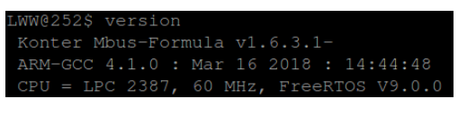

Atau klik **About** pada webserver modul konter jika modul sudah terhubung
menggunakan ethernet

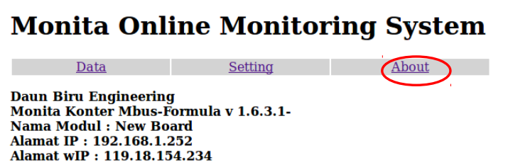

3. Sambungkan kabel ethernet ke modul konter. **Pastikan kabel ethernet**
   **tersebut sudah terhubung ke koneksi DBE.**

4. Pastikan laptop sudah terhubung ke Wi-Fi DBE/DBE1/DBE3

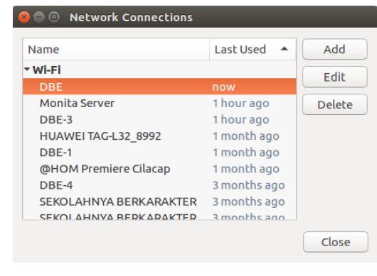

5. Lakukan pengujian Ethernet dengan cara masuk **gtkterm** kemudian
   perintah command ketik **cek_env**. IP Address pada gambar berikut
   merupakan IP Address modul konter

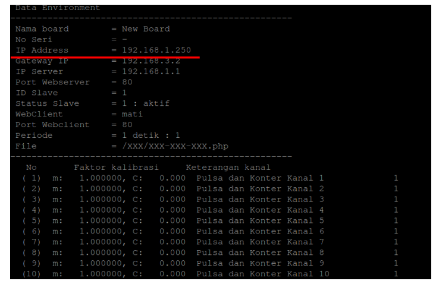

6. Cek IP Address tersebut di web browser.

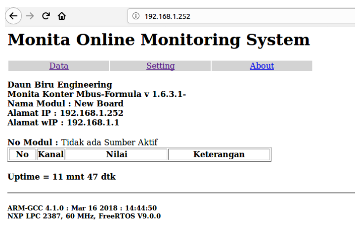

7. Klik **Setting > Modul**

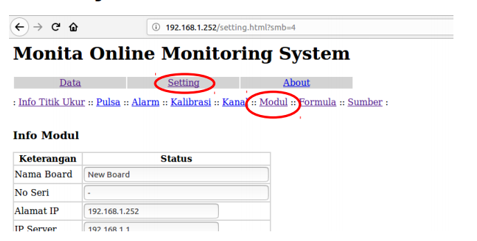

8. Setting info modul seperti dibawah ini :

   **Wajib diisi** : No Seri,

   **Wajib di ubah** : IP Server, Port Webclient, Status Web
   Client, Periode Kirim, Lokasi File.
   Lalu klik **Ganti**, Contoh :

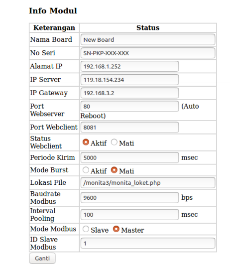

9. Klik **Setting** > Klik **Sumber**
   Klik **Aktif** pada kolom Status baris ke-1 > Klik **Ganti**

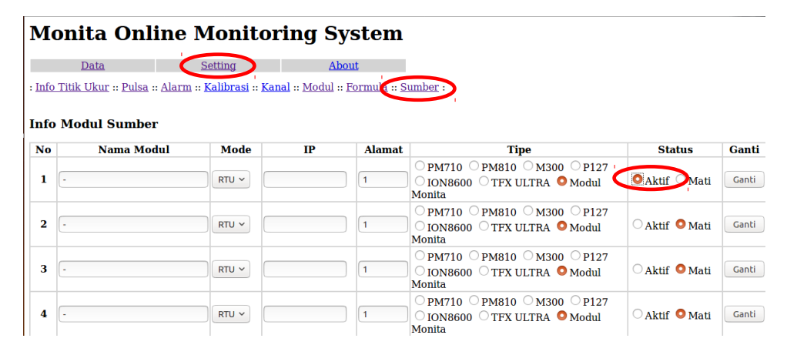

10. Klik **Setting** > Klik **Info Titik Ukur**
    Klik **Aktif** pada kolom Status, misal pada kanal 1 > Klik **Ganti**

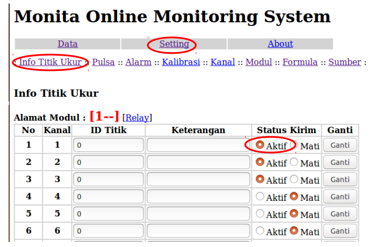

11. Restart modul dengan perintah command **reset** pada gtkterm atau
    klik **Setting** > Klik **Modul** > Klik **Restart Modul**

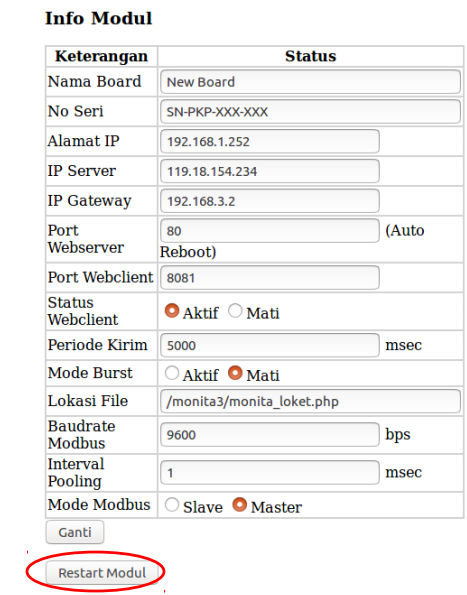

12. Buka terminal > ketik ssh cokro@10.10.10.10 password : **diesel2017**

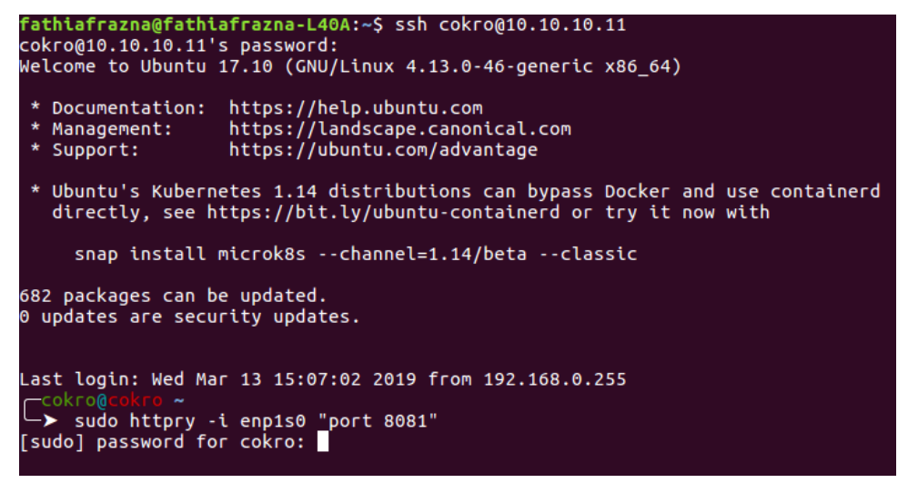

13. Ketik **sudo httpry -i enp1s0 “port 8081”** > Enter

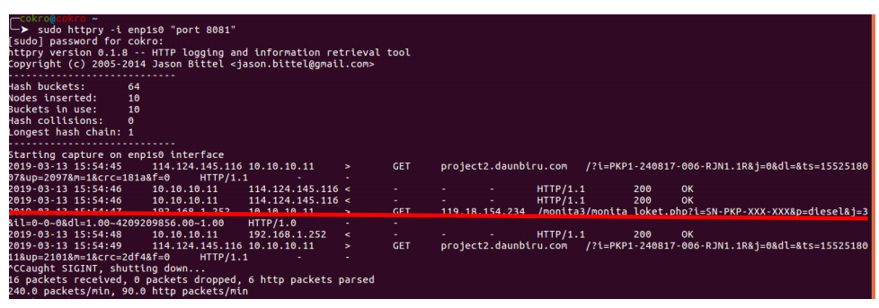

14. Cek log pengirimannya, jika ada SN yang sesuai dengan modul konter
    yang sedang mengirim data maka data berhasil dikirim ke server
    Pada pengujian ini No Seri modul konternya adalah **SN-PKP-XXX-XXX**.

15. Jika ingin meihat dengan tampilan yang menarik maka buka browser ke url
    http://project2.daunbiru.com:8081/adminer.php

    Username : loker 
    password : loker 
    database : monita_loker 
    Klik **Login**

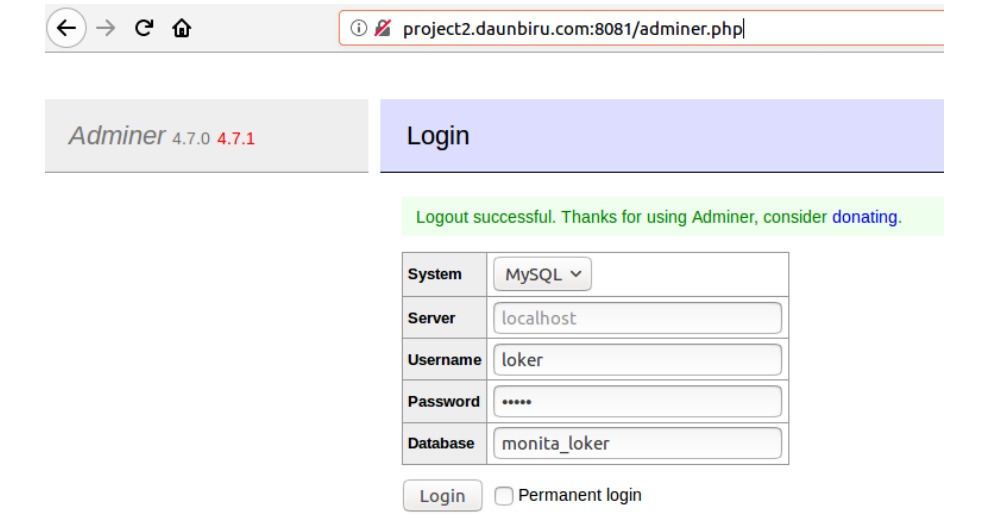

16. Klik **select** pada **select data** > klik **Last** untuk lihat pengiriman terakhir

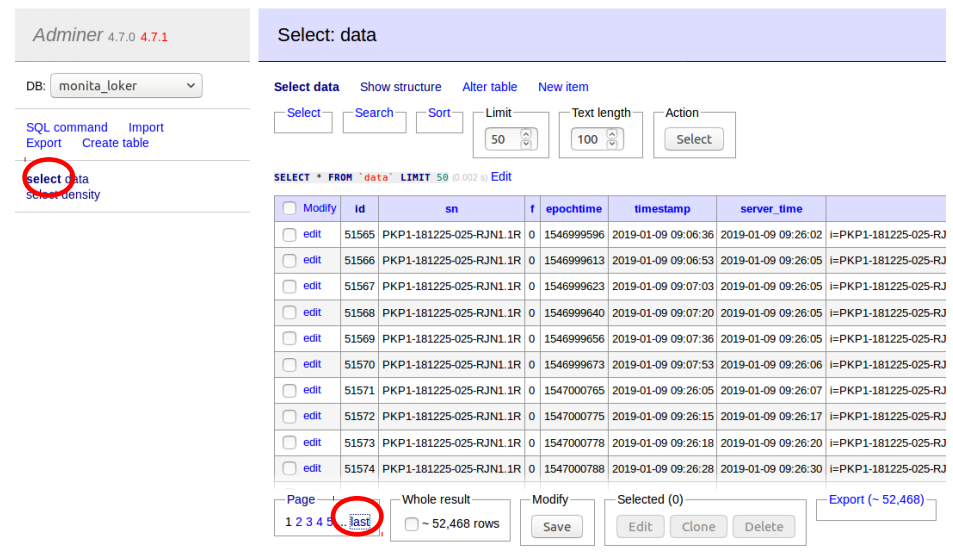

17. Cek log pengirimannya, jika ada SN yang sesuai dengan modul konter
    yang sedang mengirim data maka data berhasil dikirim ke server
    Pada pengujian ini No Seri modul konternya adalah **SN-PKP-XXX-XXX.**

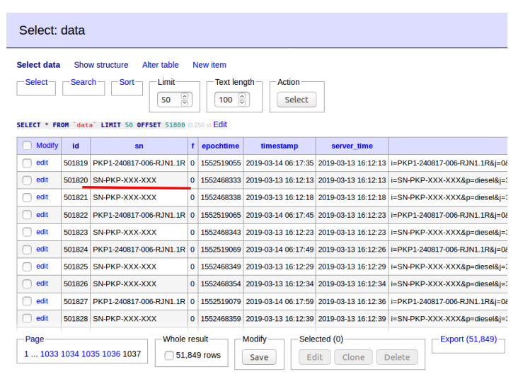
