# Modbus Master

### A. PENDAHULUAN

Dokumen Teknis ini dibuat dalam rangka menjadi panduan dalam
mengetes modbus master di modul konter.

1. Alat dan Bahan :

   a. Modul Konter 3.4

   b. Power Meter PM800

   c. Power Supply 12-24 vdc

   d. Kabel Jumper (untuk Koneksi Modbus)

   e. Kabel Serial RS 232 & Bafo serial to USB

   f. Suntikan firmware konter_1.6.3.1-fix.hex

### B. PENGUJIAN

#### Setting Power Meter

1. Sebelum menghubungkan Power Meter dengan 220 volt, cek terlebih dahulu
   kabel AC dengan tes pen untuk mengetahui kaki +, -, dan ground yang akan
   dihubungkan ke power meter.

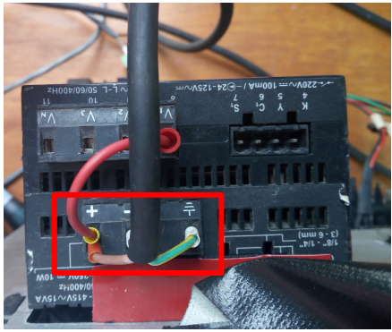

2. Hubungkan dengan jumper kaki + tegangan AC ke port V1

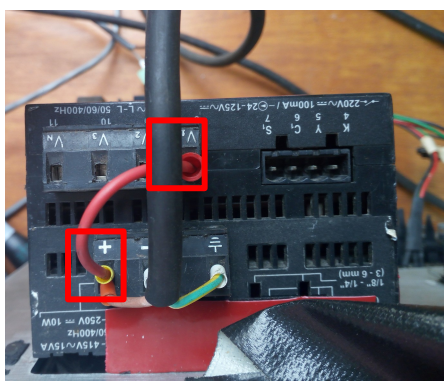

3. Setelah itu hubungkan Power Meter dengan 220 volt. Jika muncul tampilan
   seperti ini pada Power Meter, berarti Power Meter telah siap digunakan.

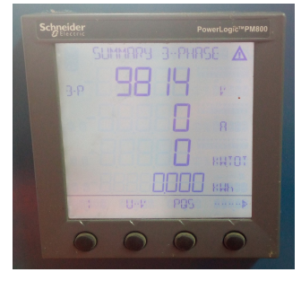

4. Tekan tombol yang paling kanan pada Power Meter sebanyak 4 kali

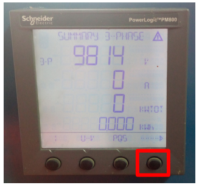

5. Sampai ada tulisan “MAIN” pada tampilan Power Meter. Lalu tekan tombol
   kedua dari kiri seperti gambar berikut

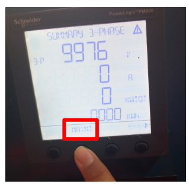

6. Tekan tombol ketiga dari kiri untuk memilih menu “SETUP”

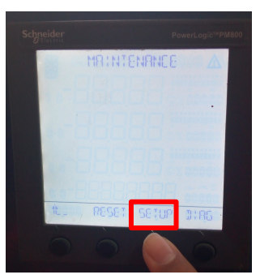

7. Tekan lagi tombol ketiga dari kiri sampai ada tampilan “0000”

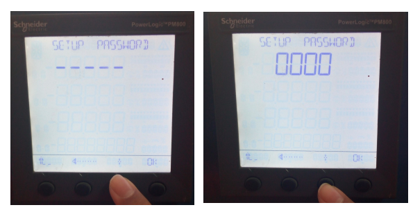

8. Tekan tombol paling kanan untuk “OK”

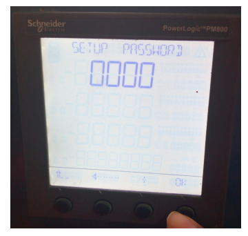

9. Tekan tombol paling kanan 1 kali lalu tombol ketiga dari kiri untuk memilih
   tampilan “COM”

10) Jika berhasil akan muncul gambar berikut. Pastikan koneksinya
    **“MBRTU”** untuk koneksi modbus RTU. **“ADDR”** berarti id slave Power
    Meternya, **“BAUD”** berarti baudrate yang digunakan. Untuk merubahnya
    tekan tombol ketiga dari kiri. Untuk next/OK tekan tombol paling kanan.
    Jika ingin kembali ke tampilan awal tekan tombol paling kiri

### Setting Modul Konter

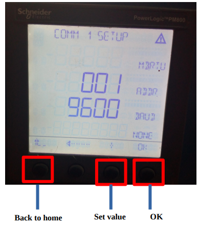

11. Pastikan power supply 12-24v sudah terhubung ke modul konter

12. Pastikan firmware yang berjalan di modul konter adalah v.1.6.3.1.
    Caranya dengan ketik perintah command **version** di gtkterm
    Back to home Set value OK

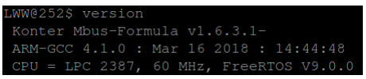

    Atau klik **About** pada webserver modul konter jika modul sudah terhubung
    menggunakan ethernet

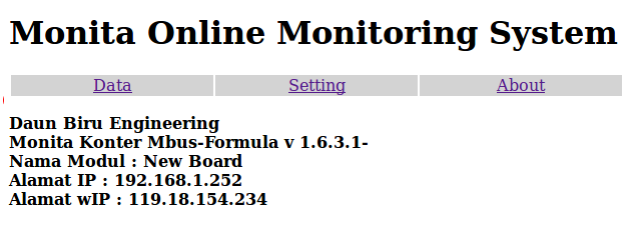

13. Sambungkan kabel ethernet ke modul konter. **Pastikan kabel ethernet**
    **tersebut sudah terhubung ke koneksi DBE.**

14. Pastikan laptop sudah terhubung ke Wi-Fi DBE/DBE1/DBE3

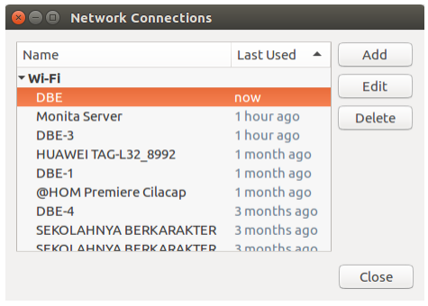

15. Lakukan pengujian Ethernet dengan cara masuk **gtkterm** kemudian
    perintah command ketik **cek_env.** IP Address pada gambar berikut
    merupakan IP Address modul konter

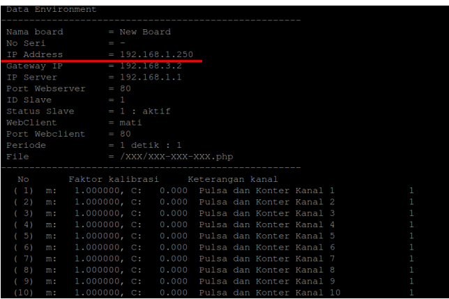

16. Cek IP Address tersebut di web browser.

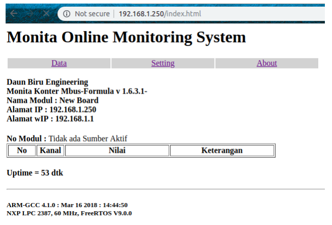

17. Klik **Setting > Modul** > Pastikan baud rate modbus **9600 bps** dan Mode
    **Modbus Master** > Klik **Ganti** > klik **Restart Modul**

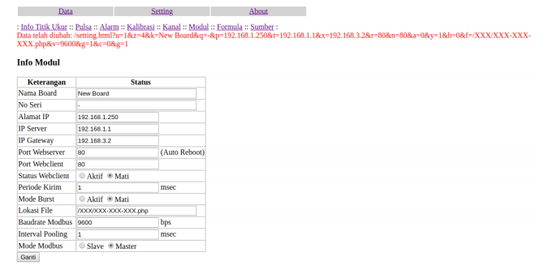

18. Klik **Setting > Sumber >** klik status **“Aktif”** pada sumber-1 > Klik **Ganti** >
    aktifkan pula sumber ke-2

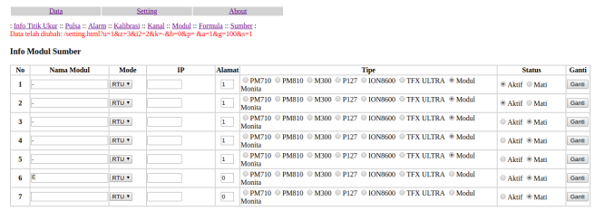

19. Mengaktifkan sumber ke 1 untuk menampilkan data kanal dari 1-20
    sedangkan sumber ke 2 dari 21-40. Begitu pula untuk sumber berikutnya

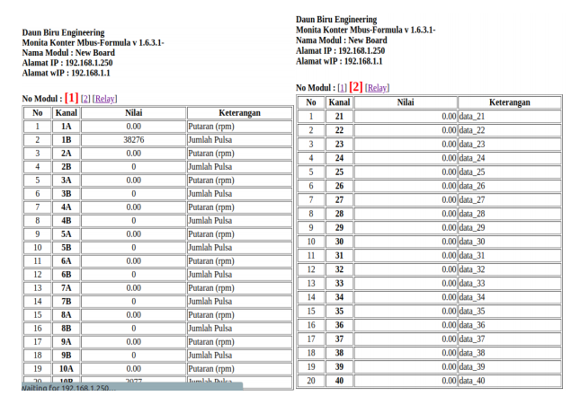

20. Sebelum menarik data Power Meter lewat modbus, kita harus mengetahui
    dulu **Register List** dari PM800. Dari sini kita dapat mengetahui register
    tersebut tipe datanya integer, Read Only, dan jika sizenya 1 berarti 16 bit

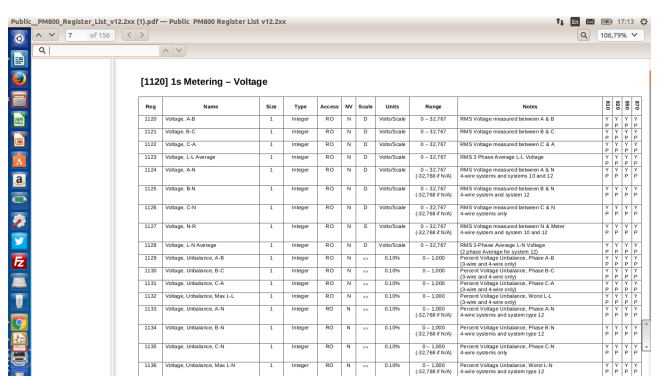

21. Register 1123 → **Voltage L-L** Average berarti data Voltage pada
    tampilan awal Power Meter

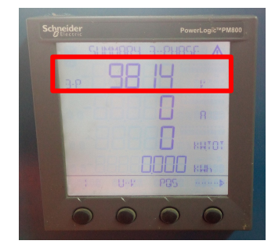

22. klik tombol kedua dari kiri untuk menampilankan “U-V”. 1-2 itu data
    **voltage A-B**, 2-3 itu data **voltage B-C**, 3-1 itu data **voltage C-A**
    Register 1120 → **Voltage A-B → 1-2**
    Register 1121 → **Voltage B-C → 2-3**
    Register 1122 → **Voltage C-A → 3-1**

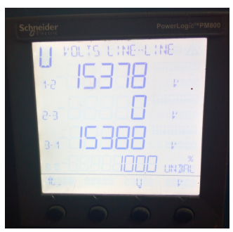

23. Start address dikurangi satu dari yang tercantum di register list. Di sini
    kita akan mengambil data voltage A-B, B-C, C-A, dan L-L Average maka num
    coil nya 4. Dest Addressnya 21 itu artinya modul akan menyimpan data yang
    diterima dari Power Meter disimpan di register kanal 21. Swap nya normal.
    Tipe data integer. Width 16 bit. Status “On”. Klik “Ganti”

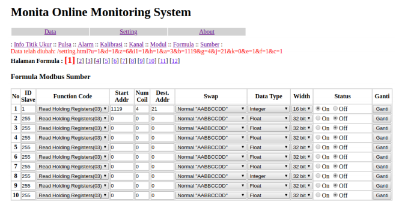

24. Klik Data > klik [2] > pastikan data yang muncul pada kanal 21-24 sama
    dengan tampilan yang ada di Power Meter

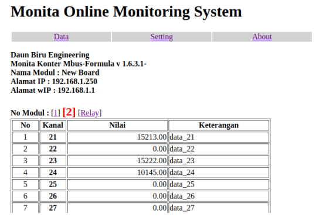
