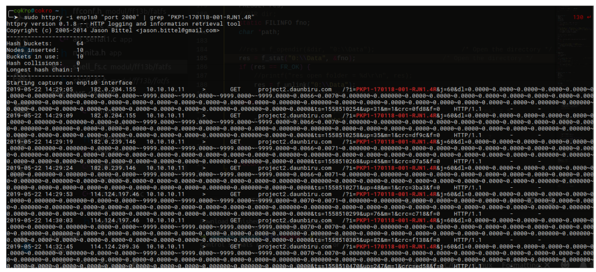
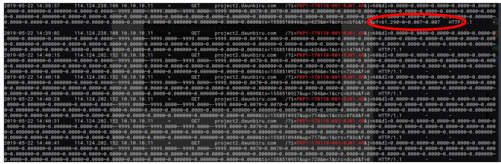
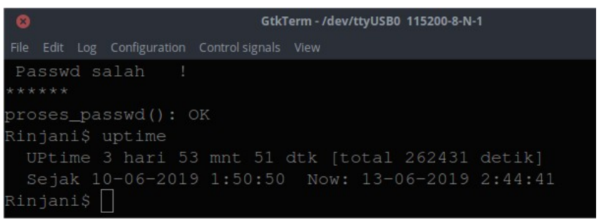
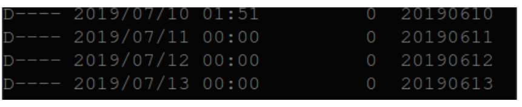
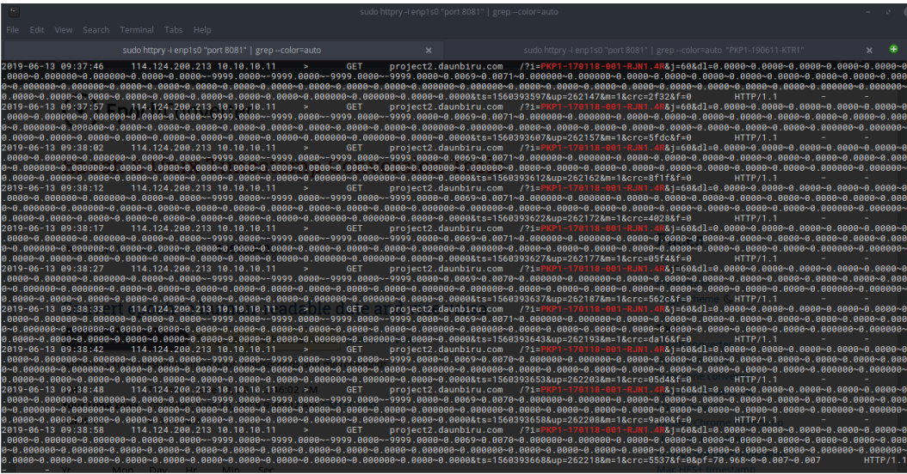

# Parameter Performance

1.  Penambahan parameter data performance memiliki format sebagai berikut :

    `&pf=70.968~0~0.007~0.007`

• Data-1 : signal modem (dalam bentuk %)<br>
• Data-2 : status sdcard (sdcard normal = 0, tidak normal != 0)<br>
• Data-3 : Teg. Batre (Kanal 5 - Analog)<br>
• Data-4 : Teg. Charger (Kanal 6 – Analog)<br>

2. Parameter performance disisipkan di parameter terakhir yang dikirim ke server
   Contoh :

```
2019-05-22 14:38:57 114.124.238.108 10.10.10.11 > GET

project2.daunbiru.com /?i=PKP1-170118-001-

RJN1.4R&j=60&dl=0.0000~0.0000~0.0000~0.0000~0.0000~0.0000~0.000000~0.00
0000~0.0000~0.0000~-9999.0000~-9999.0000~-9999.0000~-
9999.0000~0.0070~0.0070~0.000000~0.000000~0.0000~0.0000~0.0000~0.0000~0.
0000~0.0000~0.0000~0.0000~0.000000~0.000000~0.0000~0.0000~0.0000~0.0000
~0.0000~0.0000~0.0000~0.0000~0.000000~0.000000~0.0000~0.0000~0.0000~0.00
00~0.0000~0.0000~0.0000~0.0000~0.000000~0.000000~0.0000~0.0000~0.0000~0.
0000~0.0000~0.0000~0.0000~0.0000~0.000000~0.000000~0.0000~0.0000&ts=155
8510846&up=623&m=1&crc=cbf6&f=0&pf=61.290~0~0.007~0.007 HTTP/1.1
```

### Monita Rinjani : Pengetesan

1. Pengiriman ke server mulai jam `14:29:05`



2. Muncul parameter pf pada waktu `14:38:57`



Tambahan :

Pengujian dilakukan 3 hari



Status SDCard normal



httpry pengiriman data server cokro


