# Menyimpan File Via SD Card (Via gtkterm)

1. Cek_file berfungsi untuk melihat data apa saja yang akan disimpan ke dalam
   SDCard. Caranya ketik **cek_file**

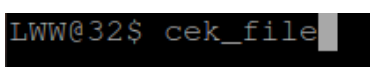

2. Tampilan setelah **cek_file**

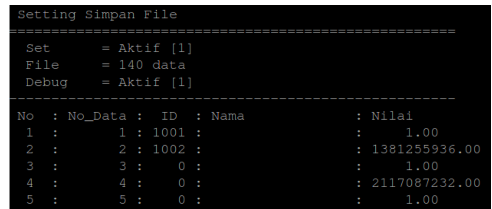

3. Untuk mengaktifkan penyimpanan ketik **set_file set/aktif**

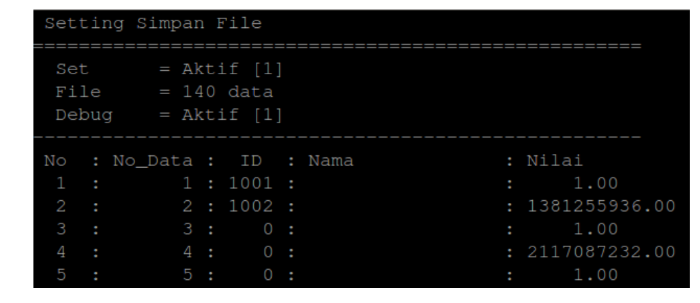

4. Untuk menonaktifkan penyimpanan ketik **set_file unset/mati**

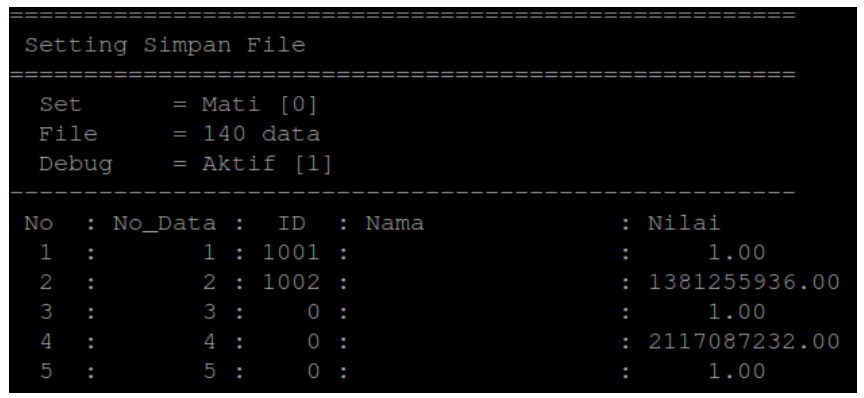

5. Untuk mengaktifkan debug SDCard ketik **set_file debug 1**

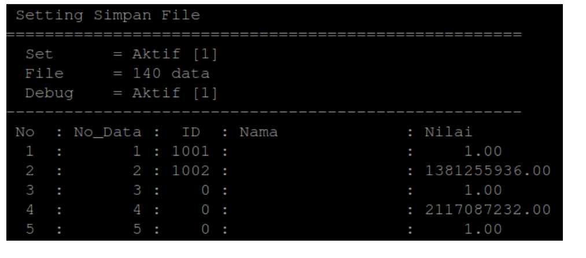

6. Untuk menonaktifkan debug SDCard ketik **set_file debug 0**

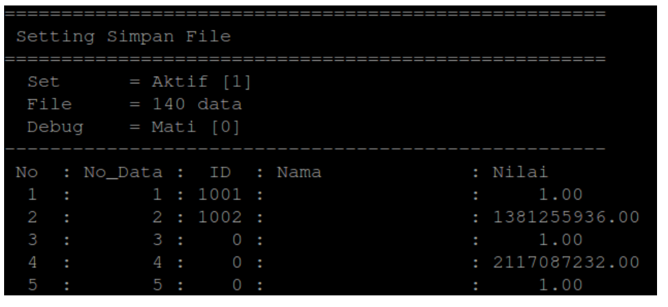

7. Menghapus data ke-140 dari list file ketik **set_file data 140 unset**

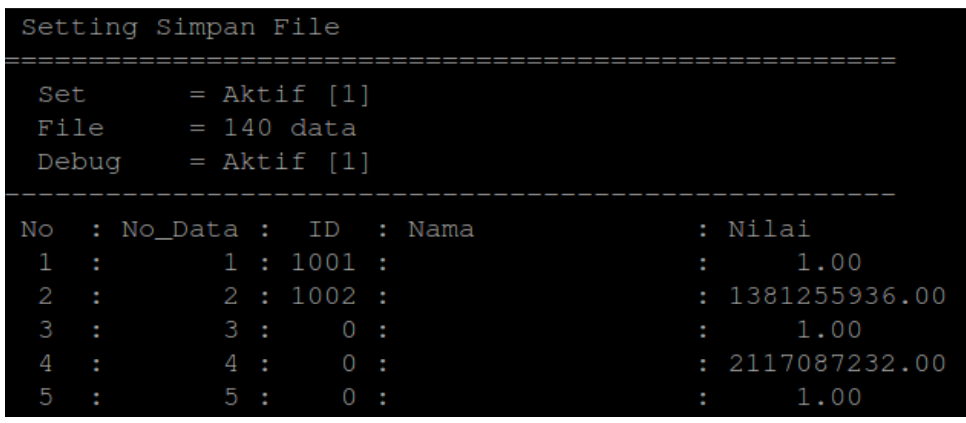

8. cek_file untuk melihat apakah data ke-140 telah terhapus

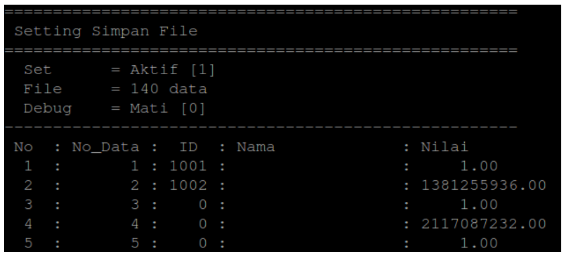

9. Menambahkan data ke-140 dari list file ketik **set_file data 140**

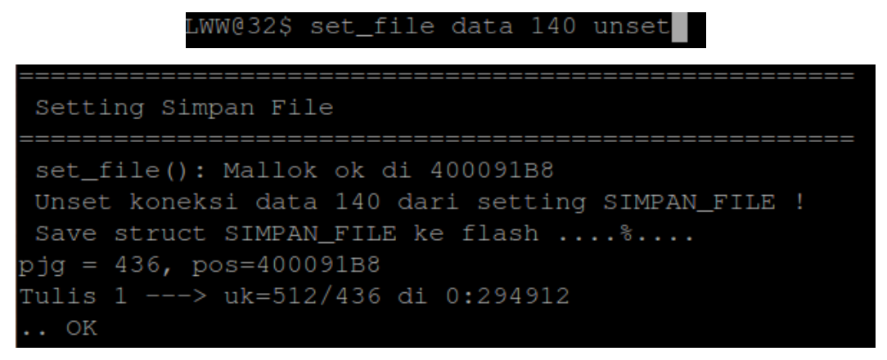

10. Cek_file untuk melihat apakah data ke-140 telah ditambahkan

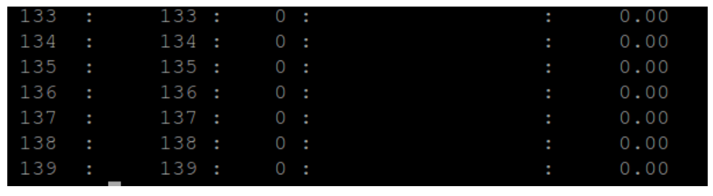

11. Ketik **ls** untuk melihat isi sdcard

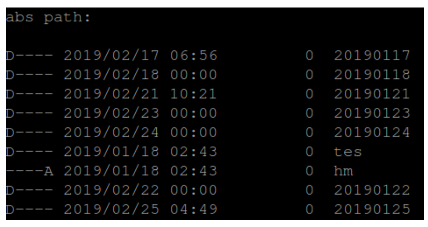

12. Ketik **cd nama_folder** untuk masuk ke folder.

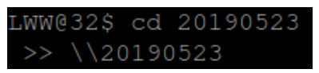

13. Ketik **ls** kembali untuk melihat isi folder

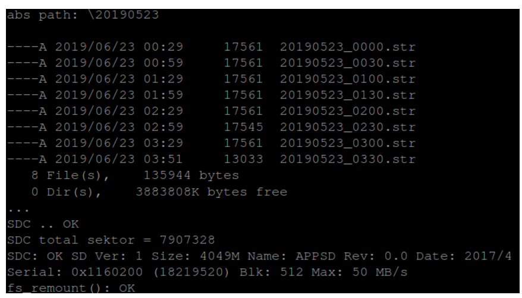

14. Ketik **rm nama_file** untuk menghapus file

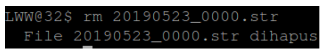

15. Ketik **cd** \ untuk kembali ke folder sebelumnya

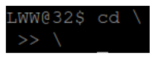

16. Ketik **cd nama_folder** lagi untuk melihat apakah file yang sebelumnya di hapus
    sudah tidak ada

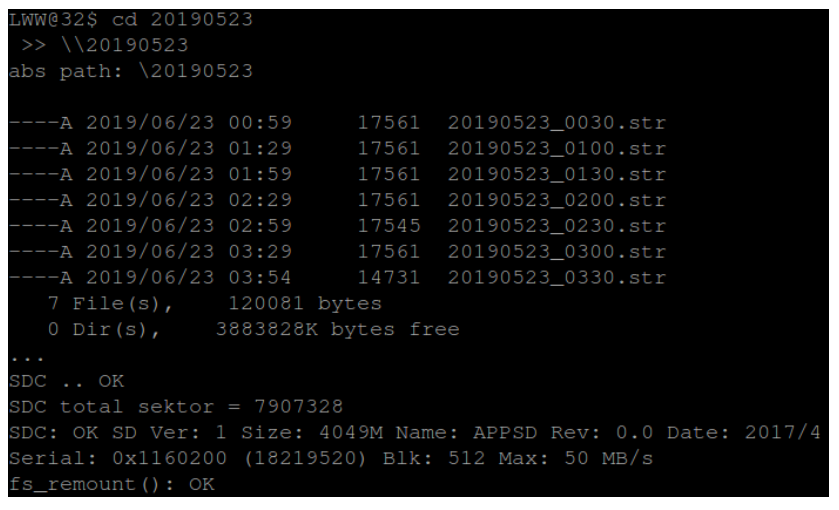
