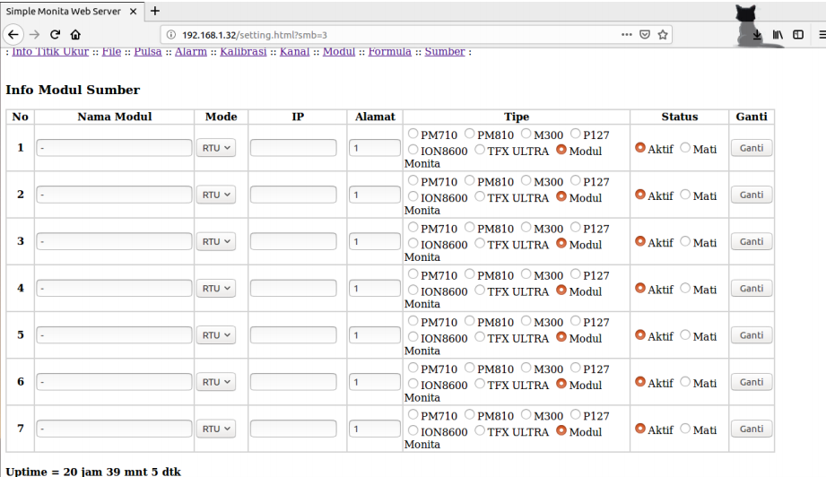
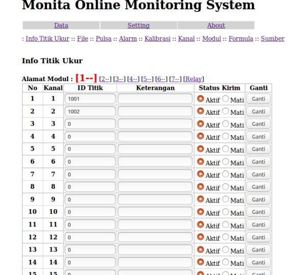
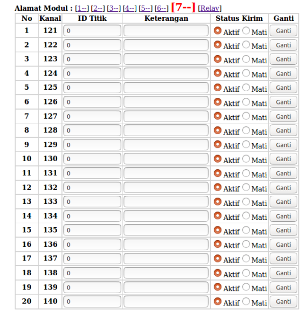
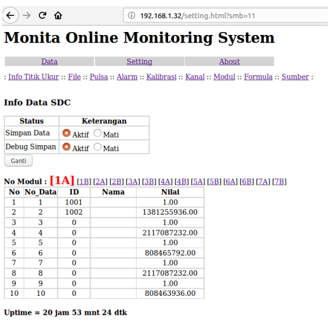

# Menyimpan File Via SD Card (Via Web Server)

1. Pertama buka web server konter sesuai ip yang telah di setting lalu diaktifkan
   semua sumber yang tersedia (7 sumber).

2. Setiap 1 sumber memiliki 20 data, sehingga jika ada 7 sumber yang diaktifkan
   maka ada 140 data yang tersedia

 

3. Data tersebut diaktifkan untuk dapat dikirim ke server. Jika data aktif, maka data
   tersebut otomatis akan tersimpan di dalam SDCard. Lihat di pilihan menu “File”.

